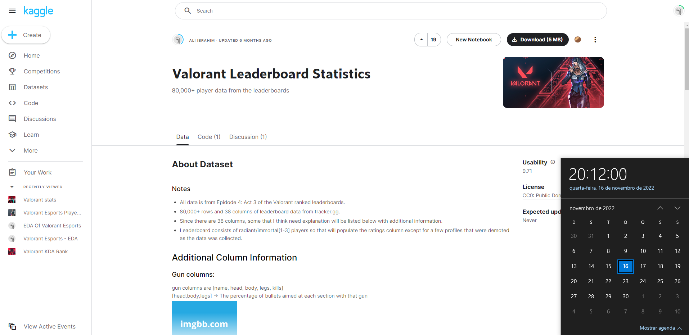

  

  <h3 align="center">
    valorant_stats
  </h3>
  

    <a href="https://github.com/viniciusgugelmin/data-science-3/blob/master/README.md"><strong>Explore the docs »</strong></a>
  

  
<h2 style="display: inline-block">📜 Abstract</h2>

- [About The Project](#about-the-project)
- [Source](#source)

## 📋 About The Project

**(Portuguese)**

Médias de todos os dados/pontuações adquiridas pelos melhores jogadores de Valorant do Episódio 4: Ato 3, coletados através do site [Valorant Tracker](https://tracker.gg/valorant/leaderboards/ranked/all/default?page=1&act=3e47230a-463c-a301-eb7d-67bb60357d4f).

**(English)**

Averages of all data/scores acquired by the best Valorant players of Episode 4: Act 3, collected through the [Valorant Tracker](https://tracker.gg/valorant/leaderboards/ranked/all/default?page=1&act=3e47230a-463c-a301-eb7d-67bb60357d4f) website.

## 🔗 SOURCE

**(Portuguese)**

- **Nome original do projeto**: Valorant Leaderboard Statistics
- **Disponível em**: https://www.kaggle.com/datasets/aliibrahim10/valorant-stats
- **Baixado em**: 16/11/2022 20:12:00
- **Imagem**:
  

**(English)**

- **Original project name**: Valorant Leaderboard Statistics
- **Available at**: https://www.kaggle.com/datasets/aliibrahim10/valorant-stats
- **Downloaded at**: 11/16/2022 20:12:00
